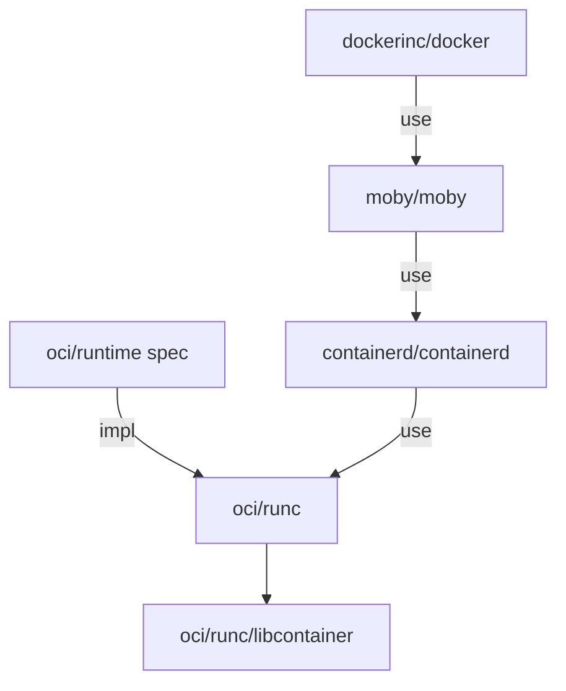

# Container Security
***Containers are not contained***
## Containers and system calls
![[image-24.png]]
```bash
# demo a container can contact the kernel space from inside
kubectl run pod --image=nginx
kubectl exec pod -it -- bash

# inside container
uname -r

# outside container 
# use strace to see the kernel call
strace uname -r
```
## Sandbox
- In k8s, sandbox is a security layer to reduce attack surface.
- If a container has a sandbox, that means the container can't communicate with the system calls directly.
- Sandbox comes not for free:
	- More resources needed
	- Might be better for smaller containers
	- Not good for `syscall` heavy workloads
	- Not direct access to hardware
## Open Container Initiative (OCI)
- Linux Foundation project to design open standards for virtualization.
- Specifications:
	- Runtime
	- Image
	- Distribution
- Runtime:
	- `runc` (container runtime that implements their specification)

## Container runtime interface (CRI)
- CIR is an API allows the `kubelet` to communicate with different container runtimes.
- In simple terms, it's a standardized plug that lets Kubernetes use any container runtime that supports the standard, without needing to have code specific to that runtime built into the project.
![[image-25.png]]
## Container runtime
- The engine running the images needs to be secured.
- Options:
	- gVisor
	- Kata
	- Firecracker
	- Unik
## `RuntimeClass`
- The `RuntimeClass` is a feature which needs to be enabled on both `kube-apisever` and `kubeletes` on every node that use runtime. While you can create the object in the API server, and declare the engine to start when a pod requests it, without the backend being configured, the pod will never reach the **ready** state.
```yaml
# cluster
apiVersion: node.k8s.io/v1  
kind: RuntimeClass  
metadata:  
name: gvisor  
handler: runsc
...

# conatiner
...
spec:  
runtimeClassName: gvisor #<<--This must match the name of the runtime above  
containers:
...
```
### gVisor
- User-space kernel for containers.
- Not hypervisor/VM based.
- A Go written sandbox often used along with rule-based execution tools such as SELinux or `seccomp`.
- It provides an independent kernel between the host and the containerized application.
- Each container has dedicated gVisor, which consists of 2 processes:
	- Sentry: handles all the kernel functionality the container requires.
	- Gofer: handles access to filesystem, and runs in a restricted `seccomp` container.
- These 2 processes communicate with each other using the 9P protocol. This approach offers isolation similar to virtual machines but less overhead.
- Simulates kernel `syscalls` with limited functionality.
- As gVisor intercepts the application system calls, there may be some application compatibility concerns and higher overhead per system call. As result, applications with system call intensive workloads may not perform well using gVisor.
- Runtime called `runsc`.
![[image-26.png]]
### Kata
- Unlike traditional containers which share a host kernel and use namespaces to keep isolated, Kata leverage hardware virtualization, to provide per-container kernels. This provides an extra layer of isolation for workload and security concerns.
![[image-15.png]]
- String separation layer.
- Runs every container in its own private VM (hypervisor based).
- Needs virtualization, like nested virtualization in cloud. QEMU as default.
## Trusted packages
- Software should be drawn from trusted sources and checked to ensure they have not changed since creation.
- Options:
	- The Update Framework
	- Uptane
	- Notary
## Centralize tools
- The easiest way to implement policy-based access is to setup the infrastructure before the cluster is in use.
- Options: Open Policy Agent (OPA).
- The Gatekeeper project uses admission controller and the OPA Constraint Framework to act as a bridge between the API server and OPA.
- Policies are used to make decisions when presented with structured documents.
## Gatekeeper
![[image-16.png]]
## Constraint template
- A constraint template is used to create a Custom Resource Definition (CRD) which extends the OPA policy library. It defines the object which will then be called via the `constraint`.
```yaml
apiVersion: templates.gatekeeper.sh/v1  
kind: ConstraintTemplate  
metadata:  
  name: k8srequiredlabels  
spec:  
  crd:  
    spec:  
      names:  
        kind: K8sRequiredLabels  
      validation:  
        openAPIV3Schema:  
          properties:  
            labels:  
              type: array  
              items: string
...
targets:  
  - target: admission.k8s.gatekeeper.sh  
    rego: |  
      package k8srequiredlabels** 

      **violation[{"msg": msg, "details": {"missing_labels": missing}}] {  
        provided := {label | input.review.object.metadata.labels[label]}  
        required := {label | label := input.parameters.labels[_]}  
    missing := required - provided  
        count(missing) > 0  
        msg := sprintf("You must provide labels: %v", [missing])  
      }
# the second half of the constraint template declares the target which will be responsible for passing along the API information.
```
### Constraint
```yaml
apiVersion: constraints.gatekeeper.sh/v1  
kind: K8sRequiredLabels  
metadata:  
  name: ns-require-label  
spec:  
  match:  
    kinds:  
 - apiGroups: [""]  
        kinds: ["Namespace"]  
  parameters:  
    labels: ["gk-ns"]
```
## Mitigating kernel vulnerabilities
### Blocking dynamic module
- Rootkits contains kernel modules which, one loaded, completely hide the rootkit from the typical system tools. In order to address this problem, the kernel community came up with a mechanism that disables kernel module loading completely.
- Rootskits usually work as follows:
	1. Escalate privileges to root
	2. Load kernel modules to hide the rootkit
	3. Remove all traces of the rootkit
### `kernel.modules` disabled
- System admins can use a one-way method to block module loading after the system has booted and all modules have been loaded. This mechanism consists in writing 1 to `kernel.modules_disabled`. This required root or `CAP_SYS_MODULE` capabilities. No other module-related operations will be allowed from that point on.
### Adaptive stack layout randomization
- All address spaces used to be built in the same way. Memory regions showed up at known addresses, this created some attack vectors.
- Address Space Layout Randomization (ASLR) places various memory areas of a user-land executable in random locations, which helps prevent certain classes of attacks.
- `kernel.randomize_va_space sysctl`:
	- 0: disabled
	- 1: randomized stack, VDSO (Virtual Dynamic Shared Object), shared memory addresses
	- 2: randomized stack, VDSO, shared memory and data addresses.
### Hardware security features
- The Linux kernel also supports hardware security features where available, such as NX (No eXecute), VT-d (virtualization), the TPM (Trusted Platform Module), TXT (Trusted Execution Technology), and SMAF (Secure Memory Allocation Feature), along with various support for hardware cryptographic devices.
### No eXecute
- Most modern CPUs can protect against the execution of memory regions that should not contain executable code (heap, stack, ...), which helps block the exploitation of many security vulnerabilities. Since this is implemented at a hardware level, applications typically do not need to suffer from any performance overhead.
- Look for the `nx` flag in `/proc/cpuinfo`. It may be enabled/disabled in BIOS.
### `ExecShield`
- The `ExecShield` feature provides protection against stack, buffer or function pointer overflows, and against other types of exploits that rely on overwriting data structures and/or putting code into those structures. The patch also makes it harder to pass in and execute the so-called _shell-code_ of exploits. The patch works transparently, i.e. no application recompilation is necessary.
- The `exec-shield` feature works via the kernel transparently tracking executable mappings an application specifies, and maintains a maximum executable address value. This is called the `exec-limit`. The scheduler uses the `exec-limit` to update the code segment descriptor upon each context switch. Since each process (or thread) in the system can have a different `exec-limit`, the scheduler sets the user code segment dynamically so that always the correct code-segment limit is used.
- The kernel caches the user segment descriptor value, so the overhead in the context-switch path is a very cheap, unconditional 6-byte write to the GDT, costing 2-3 cycles at most. Furthermore, the kernel also remaps all `PROT_EXEC` mappings to the so-called ASCII-armor area, which on x86 is the addresses 0-16MB. These addresses are special because they cannot be jumped to via ASCII-based overflows.
	- No eXecute (NX) ancestor
	- Implemented in software. No hardware support is needed. Has more overhead than NX.
	- It is not always compiled in recent kernels
	- It is enabled as a `sysctl`:  
	    `# echo 0 > /proc/sys/kernel/exec-shield`
```ad-note
In many recent kernels the ExecShield feature was replaced with NX (not executable) hardware support
```
### Vt-d Virtualization
- Intel's VT-d is a technology that allows VMs to directly access the hardware. Beyond the obvious performance gains, the other advantage is that the virtual machine does not have to rely on the hypervisor or host OS support of the hardware.
- Look for `vmx or svm` in `/proc/cpuinfo`.
### Trusted Platform Module (TPM)
- A hardware feature that provides a way to store checksums:
	- For boot volumes, biometric data, ...
	- Can be used later for comparison and authentication.
### Trusted Executed Technology (TXT)
- Used to isolate the memory used by guest virtual machines. A guest VM could have a malicious kernel that tried to access memory owned by a host or another guest. TXT is an efficient, hardware-based method for preventing this from happening.
- Purely software hypervisors also have this important feature, but they bring more overhead since the hardware does not assist with the memory protection. TXT also comes into play for controlling what can access hardware peripherals.
	- - TXT is used to establish trust in a virtual environment, ensuring that an application has not been modified and that an application is executed by a trusted kernel.
	- It is coupled with TPM
	- Provides a way to store the checksum associated with the kernel to be booted
	- Can also checksum applications to be run on top of the trusted kernel.
### Integrity management
- The kernel’s integrity management subsystem may be used to maintain the integrity of files on the system. The Integrity Measurement Architecture (IMA) component performs runtime integrity measurements of files using cryptographic hashes, comparing them with a list of valid hashes. The list itself may be verified via an aggregate hash stored in the TPM. Measurements performed by IMA may be logged via the audit subsystem, and also used for remote attestation, where an external system verifies their correctness.
- IMA is a Linux-trusted computing implementation that:
	- Detects if files have been accidentally or maliciously altered
	- Compares a file's checksum against a good value
	- Enforces local file integrity.
- IMA can rely on the hardware TPM if present.
- IMA may also be used for local integrity enforcement via the Appraisal extension. Valid measured hashes of files are stored as extended attributes with the files, and subsequently checked on access. These extended attributes (as well as other security-related extended attributes), are protected against offline attack by the Extended Verification Module (EVM) component, ideally in conjunction with the TPM. If a file has been modified, IMA may be configured via policy to deny access to the file. The Digital Signature extension allows IMA to verify the authenticity of files in addition to integrity by checking RSA-signed measurement hashes.
- IMA was first introduced in kernel 2.6.30:
	- Look for `CONFIG_IMA` in `/boot/config`
	- Boot with `ima_tcb` and `ima=on` kernel parameters.
### Integrity management with `dm-verity`
- A simpler approach to integrity management is the `dm-verity` module. This is a device mapper target which manages file integrity at the block level.
- It is intended to be used as part of a verified boot process, where an appropriately authorized caller brings a device online, say, a trusted partition containing kernel modules to be loaded later.
- The integrity of those modules will be transparently verified block by block as they are read from disk.
	- Relies on the kernel crypto-API to produce a cryptographic digest of all data blocks. No specialized hardware device is required.
	- The goal is to detect device tempering before I/O requests complete.
	- Check for `CONFIG_DM_VERITY` under `/boot/config`.
### Linux Security Modules (LSM)
- The Linux Security Modules (LSM) API implements hooks at all security-critical points within the kernel. A user of the framework (an LSM) can register with the API and receive callbacks from these hooks. All security-relevant information is safely passed to the LSM, avoiding race conditions, and the LSM may deny the operation. This is similar to the Netfilter hook-based API, although applied to the general kernel.
- The LSM API allows different security modules to be plugged into the kernel-typically access control frameworks. To ensure compatibility with existing applications, the LSM hooks are placed so that the UNIX DAC checks are performed first, and only if they succeed, is LSM code invoked.
- Various security modules leverage LSM:
	- This encourages code reuse
	- It minimizes modifications to the kernel
	- It reduces changes to the kernel ABI (Application Binary Interface)
	- No need to modify applications.
- The following LSMs have been incorporated into the mainline Linux kernel:
	- AppArmor: To restrict capabilities of an application.
	- SELinux: Implements MAC (Mandatory Access Control)
	- Smack (Simplified Mandatory Access Control Kernel)
	- TOMOYO: MAC implementation and system analysis.
### `Seccomp`
- Secure computing mode (`seccomp`) is a mechanism which restricts access to system calls by processes. The idea is to reduce the attack surface of the kernel by preventing applications from entering system calls they do not need. The system call API is a wide gateway to the kernel, and as with all code, there have and are likely to be bugs present somewhere.
- Given the privileged nature of the kernel, bugs in system calls are potential avenues of attack. If an application only needs to use a limited number of system calls, then restricting it to only being able to invoke those calls reduces the overall risk of a successful attack. Good knowledge of what the application needs is required in order to execute properly.
- The original `seccomp` code, also known as _mode 1_, provided access to only four system calls: `read(), write(), exit(), and sigreturn()`. These are the minimum required for a useful application, and this was intended to be used to run untrusted code on otherwise idle systems.
### Tools
- `grafeas`: https://github.com/grafeas/grafeas
## Container isolation
### Namespaces
- Restrict what processes can see
	- Other processes
	- Users
	- Filesystem
### `cgoups`
- Restrict the resource usage of processes
	- RAM
	- Disk
	- CPU